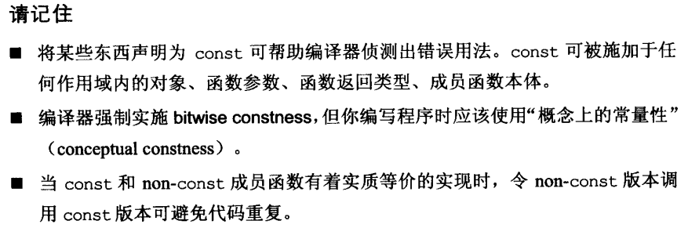
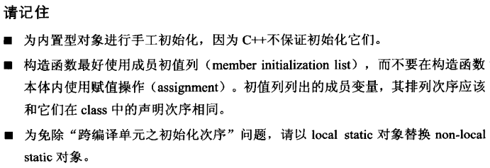

## 1. 视C++为联合体语言
可将C++视为：
- **C-like**（C语言）：区块、语句、预处理器、内置数据类型、数组、指针等；
- **Object-Oriented C++**（面向对象）：构造析构函数、封装继承多态、动态绑定等；
- **Template C++**（泛型编程）：
- **STL**：容器、迭代器、算法、函数对象等。

内置类型（C-like）值传递高效；   
自定义类（Object-C++）`const`引用传递更好；  
Template C++ `const`引用传递更好;    
STL迭代器和函数对象建立在指针上，因此值传递更好
## 2. 尽量以`const`, `enum`, `inline`替换`#define`
## 3. 尽可能使用`const`

- 令函数返回常量值，例如：
```C++
class A { ... };
const A operator*(const A& lhs, const B& rhs);
```
否则将会出现错误：
```C++
// (a * b) = c 给乘积赋值
A a, b, c;
if (a * b = c) { ... } 
```
- 将`const`用于成员函数，两点好处：
    - 可直接得知函数是否可以直接改动对象内容
    - 能操作`const`对象，例如：
 ```C++
class A {
    const A& operator[](int i) const;
    A& operator[](int i);
};

A a, b;
std::cout << a[0]; // call non-const func
a[0] = b; // √ 若返回类型非引用，则该句不成立

const A ca;
std::cout << ca[0]; // call const func
ca[0] = b; // ×
```
- 可以在`non-const`成员函数中利用两次转型调用`const`成员函数：
```C++
class A {
    const A& operator[](int i) const {
        ...
        return A;
    }

    A& operator[](int i) {
        return const_cast<A&> (
            static_cast<const A&>(*this)[i]
        );
    }
};
```
但不可以在`const`成员函数中调用`non-const`成员函数，因为存在改变对象的可能

## 4. 使用前确定对象被初始化


## 5. C++自动编写的默认函数
